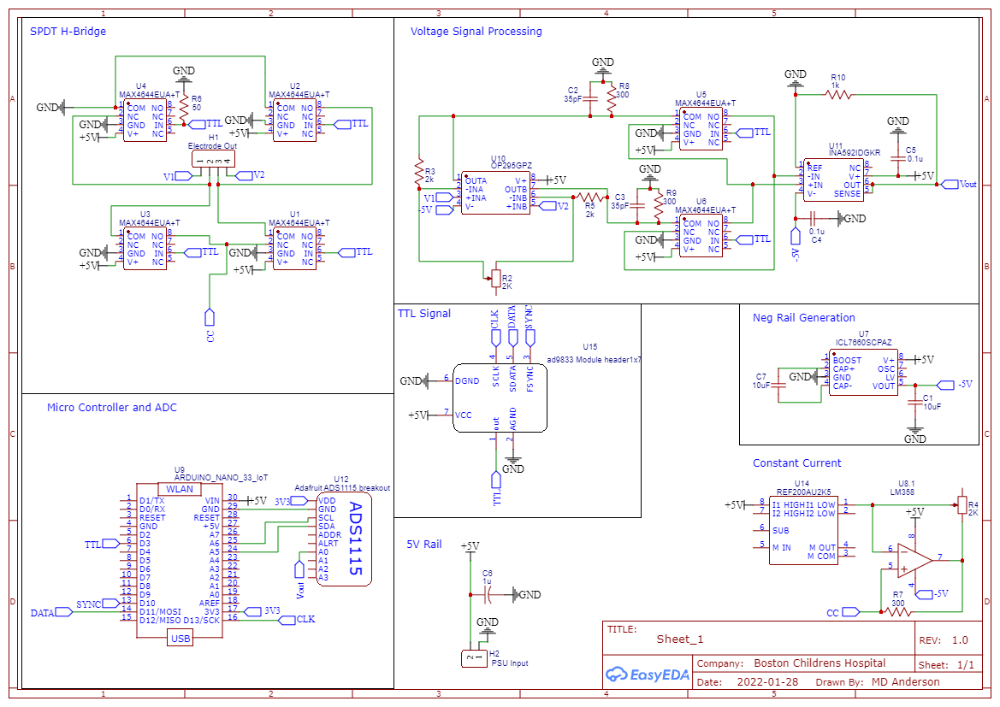

# Hardware

!The basic goal of this electronic device is to create a low fixed current, AC square wave with modulatable frequency and measure the voltage difference between the current electrodes. 

Looking at the block diagram we can see that An Arduino was used as the microcontroller for the device. A AD9388 breakout board generates a square wave timing wave that goes between V and 0 volts. An H-Bridge made from single throw dual throw (SPDT) switches allows it to be made into an AC wave at the same freq, but between +-V Volts. A constant current chip forces the current in that AC wave to be locked into a small value (20uA). The voltage difference over the cells then goes into a high input impedance diff amp. Since the incoming signal is +-V_diff, it would generate an AC output which is then hard to read off. So inside that block are two more SPDT switches to flip what input what end goes to so that the high V is always in the same input which effectively makes the diff amp output a DC signal. This signal then goes into a 16bit ADC which can be read off onto the Arduino. 

Lets take a look at and explore the overall schematic:

_TTL section_

The AD9388 chip form the effective "clock" for this device. It has a serial connection to the Arduino and can modulate its square wave output freq between single hertz and mega hertz. This provides the Arduino with a signal that triggers it to ask for a voltage read with (some delay/phase shift may be added to that in the Arduino itself). It also flips the output of all 6 SPDT switches. This allows them to generate an AC square wave allows them to flip polarity on the differential amp so that its output is DC like and positive. 

_SPDT H-Bridge_

This section converts the incoming TTL wave into an AC version. Its the exact same construction as a DC motor H-Bridge, but instead of bi-junctional transistors, it uses SPDT switches. This allows it to perform at MHz and have minimal artifacts. 

_Constant Current_

This device needs a constant current source. The REFE200AU2K5 IC has a built in 100uA constant current source. The goal for this device was 20uA. To accomplish that a LM358 op amp was added to scale down the current. A potentiometer is installed which allows this current to be modulated. 

_Voltage Signal Processing_

This uses a high impedance instrument amp. This means dual op amps interface directly with the V1 and V2 electrodes from the H-Bridge. The ultra high impedance of op amps means extremely little current is taken from the H-Bridge itself (essentially sample without disturbing the system) and then 2 SPDT switches can flip as needed to make sure the higher V value is on the V+ input of the difference amp. This way the output signal from it is effectively the absolute value of V1-V2 which is a psuedo DC signal. 

_Micro-Controller and ADC_

We employed an Arduino Nano 33 IoT as the microcontroller. This was chosen as it gives the ability to connect to wifi. The ADS1115 16 bit ADC is able to read off the voltage.

