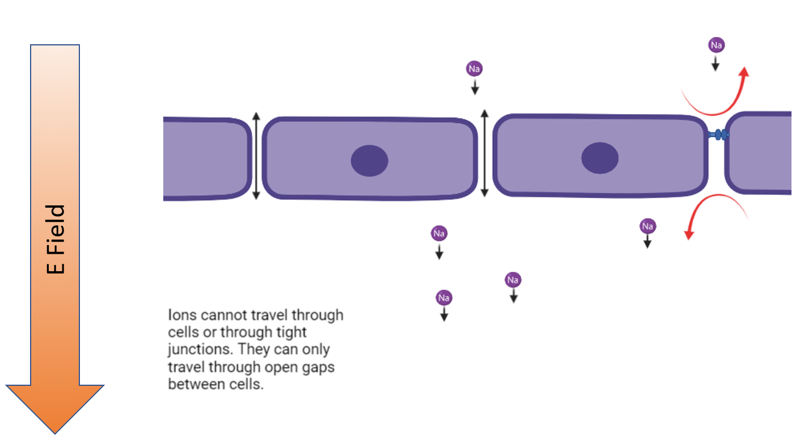
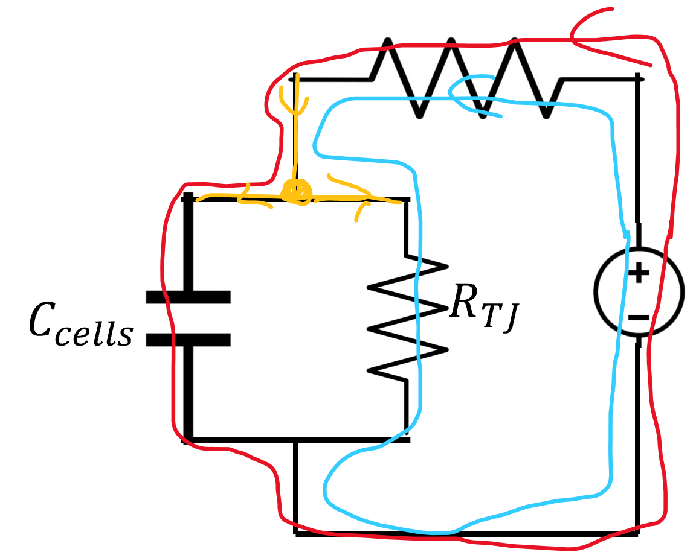
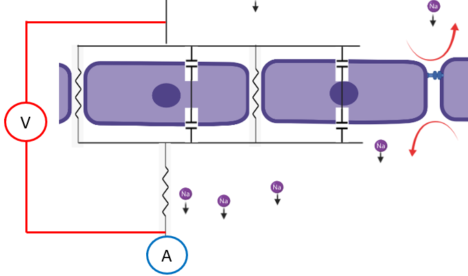
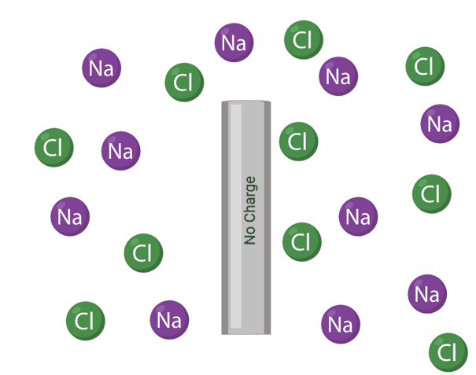
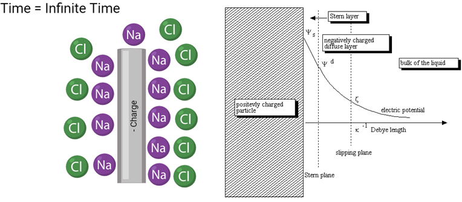
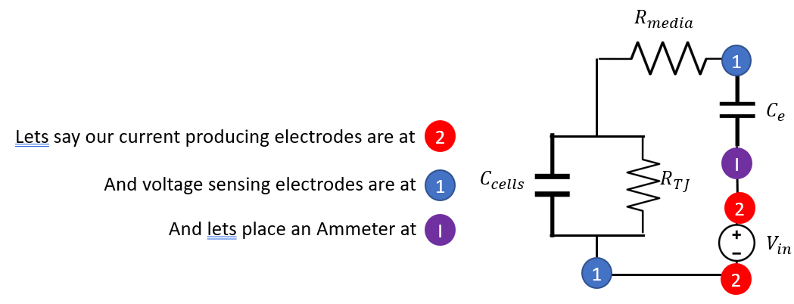

# DC Theory


The typical use of TEER is with transwells. In these, monolayers of cells are formed and ions can passively diffuse through the gaps between cells.



Lets start forming a model on this. So if a gap has a tight junction formed, it blocks the ion from going through it. If it lacks a tight junction, then the ion can go on through. Lets translate that into a simple electrical circuit model.


So we replace tight junctions and cells with open circuits and given gaps restrict the rate that charged particles can pass through the monolayer, lets say they are  resistors. So **tight junctions and cells = open circuit** and **gaps = resistors**

**Ohm's Law**
```math
 \tag{1} V = I*R 
```

**Parallel Resistance Equivalency**
```math 
 \tag{2} R_{eq} = \dfrac{1}{(\sum{\dfrac{1}{R_g}})}
```

All gap resistances are approximately equal

```math 
  \tag{3} R_{1} \approx R_{2} \approx R_{3} \approx ... \approx R_{G}
```

Sub [3] into [2]

```math 
 \tag{4} R_{eq} = \dfrac{1}{(\dfrac{1}{R_G}*N_{G})}=\dfrac{R_{G}}{N_{G}}
```

```math 
 \tag{5} N_{CJ}=N_{TJ}+N_{G} \to N_{G} = N_{CJ}-N_{TJ}
```

Sub (3) into (4) and taylor expand 

```math 
 \tag{6} R_{eq}=\dfrac{R_{G}}{N_{CJ}*(1-\dfrac{ N_{TJ}} {N_{CJ}})} \to \dfrac{R_{eq}*N_{CJ}}{R_{G}} = \dfrac{1}{(1-\dfrac{N_{TJ}}{N_{CJ}})} \approx 1+ \dfrac{N_{TJ}}{N_{CJ}}
```

Thus

```math 
 \tag{7} R_{eq} \propto N_{TJ}
```


In the previous model we considered cell bodies themselves as open circuits, but is that accurate? Check out the image below to see that they are more accurately capacitors!


Now lets add the cell capacitance and resistance due to the media into the model circuit


We need Kirchoff Loop and Node Equations to solve this one:

```math 
 \tag{8} \color{blue}{V_{in}-R_{media}*I -R_{TJ}*I_{TJ}=0}
```

```math 
 \tag{9} \color{red}{V_{in}-R_{media}*I-V_{cells}=V_{in}-R_{media}*I-\dfrac{Q}{C_{cells}}=0}
```

```math 
 \tag{10} \color{yellow}{I=I_{TJ}+I_{cells}}
```

The node and loops look like this (color coordinated)





Set (8) equal to (9)

```math 
 \tag{11} \dfrac{Q}{C_{cells}}=R_{TJ}*I_{TJ}\to \color{red}{I_{TJ}=\dfrac{Q}{R_{TJ}*C_{cells}}}
```

Sub (11) into (10)

```math 
 \tag{12} I = \dfrac{Q}{R_{TJ}*C_{cells}} + I_{cells}
```

Sub (12) into (9)

```math 
 \tag{13} V_{in}-R_{media}*(\dfrac{Q}{R_{TJ}*C_{cells}}+I_{cells})-\dfrac{Q}{C_{cells}}=0
```

Divide by R media

```math 
 \tag{14} \dfrac{V_{in}}{R_{media}}-I_{cells}-(\dfrac{1}{R_{TJ}*C_{cells}}-\dfrac{1}{R_{media}*C_{cells}})*Q=0
```

Place I and Q onto opposite sides of equation

```math 
 \tag{14} -R_{media}*C_{cells}*I_{cells}=(\dfrac{R_{media}}{R_{TJ}}+1)*Q-C_{cells}*V_{in}
```

Given Q is built up on the membranes, the whole current that passes through cells is the time derivative of the charge and lets group some constants into a new constant

```math 
 \tag{16} I_{cells}=\dfrac{\delta{Q}}{\delta{t}}, \alpha = \dfrac{R_{media}}{R_{TJ}} + 1
```

Sub (16) into (15)

```math 
 \tag{17} -R_{media}*C_{cells}*\dfrac{\delta{Q}}{\delta{t}}=\alpha*Q-C_{cells}*V_{in}
```

Separate Q and t terms to opposite sides of equation

```math 
 \tag{18} \dfrac{\delta{Q}}{Q-\dfrac{V_{in}*C_{cells}}{\alpha}}=\dfrac{-\alpha}{C_{cells}*R_{media}}*\delta{t}
```

Integrate (18)

```math 
 \tag{19} \int_{0}^{Q}  \dfrac{1}{Q-\dfrac{V_{in}*C_{cells}}{\alpha}}\delta{Q}=\int_{0}^{t} \dfrac{-\alpha}{C_{cells}*R_{media}}\delta{t}
```

Solution to (19)
```math 
 \tag{20} \ln{\dfrac{Q-\dfrac{V_{in}*C_{cells}}{\alpha}}{\dfrac{-V_{in}*C_{cells}}{\alpha}}}=\dfrac{-\alpha*t}{C_{cells}*R_{media}}
```

Raise each side to power e and solve for Q

```math 
 \tag{21} \color{red} Q(t)=\dfrac{V_{in}*C_{cells}}{\alpha}*(1-e^{\dfrac{-\alpha*t}{C_{cells}*R_{media}}})
```

now lets solve for I and V for cells (time derivative of Q and Q/C respectively)

```math 
 \tag{22} \color{red} I_{cells}(t)=\dfrac{V_{in}}{R_{media}}*e^{\dfrac{-\alpha*t}{C_{cells}*R_{media}}}
```
```math 
 \tag{23}  \color{red} V_{cells}(t)= \dfrac{V_{in}}{\alpha}*(1-e^{\dfrac{-\alpha*t}{C_{cells}*R_{media}}})
```

Now lets insert a volt and an am meter into the circuit





```math 
 \tag{24} V_{meter}(t)=R_{TJ}*I_{TJ}(t)+R_{media}*I(t)
```

```math 
 \tag{25} Blank = R_{media}*I(t)
```
```math 
 \tag{26} V_{meter}(t)-Blank=R_{TJ}*I_{TJ}(t)
```

```math 
 \tag{27} I_{meter}(t)=I(t)=I_{cells}+I_{TJ} \to I_{TJ}=I_{meter}(t)-I_{cells}
```

Sub (22) into (27)

```math 
 \tag{28} I_{TJ}(t)=I_{meter}(t)-\dfrac{V_{in}}{R_{media}}*e^{\dfrac{-\alpha*t}{C_{cells}*R_{media}}}
```

Sub (28) into (26) and solve for the tight junctional resistance

```math 
 \tag{29} \color{red}R_{TJ}=\dfrac{V_{meter}(t)-Blank}{I_{meter}(t)-\dfrac{V_{in}}{R_{media}}*e^{\dfrac{-\alpha*t}{C_{cells}*R_{media}}}}
```

So to solve for tight junctional resistance we must know how current has been applied to the circuit. That is a finicky to determine and beyond this we have a confounding factor of tight junction resistance being in the alpha term. To rectify this, lets drive this to inifinite time

```math 
 \tag{30} R_{TJ}(t)=\dfrac{V_{meter}(t)-Blank}{I_{meter}(t)}
```

This equation is easily solved with our instruments as long as we wait long enough. Lets take a stab at how fast that might be given I dont have infinite time to wait. Lets say we want to wait until the cell current has fallen to a factor of 0.01% of its original value

```math 
 \tag{31} 0.0001 =e^{\dfrac{-\alpha*t}{C_{cells}*R_{media}}}
```

```math 
 \tag{32} \ln{0.0001}=\dfrac{-\alpha*t}{C_{cells}*R_{media}}, \alpha \approx 1 \quad if \quad R_{TJ} \gg R_{media}
```

```math 
 \tag{33} -R_{media}*C_{cells}*\ln{0.0001}=t
```

To find cells we take the unit capacitance and multiply by transwell area

```math 
 \tag{34} C_{cells}=A_{transwell}*C_{unit}=3.3*10^{-5}*1*10^{-2}=3.3*10^{-7}, R_{media} \approx 50
```

```math 
 \tag{35} t = 3.3*10^{-7}*50*\ln{0.0001} \approx 0.1ms 
```

So saturation occurs very rapidly! We have another issue now. Its something that wasn't addressed in the previous model. Lets check out what happens to an electrode the second current flows from it. 








  As can be seen, a double wall is created whenever an electrode generates current in a liquid with negative and positive ions in it. This creates another component called electrode capacitance that we must add into the circuit. Beyond this, thus far we have neglected to consider a trans-cellular transport component. Here is the new circuit.

.. image:: C:\Users/mike/Documents/GitHub/Felxi-TEER/images/teer_theory/el_cap_trans.png
  :width: 800

```math 
 \tag{36} R_{TJ}+R_{TC}=R_{cells}
```

Experiments can be made to emphasize the transcellular transport component, but in general

```math 
 \tag{37} R_{TJ} \gg R_{TC}
```

```math 
 \tag{38} R_{cells} \approx R_{TJ}
```

Instead of resolving the entire equation with electrode capacitence in it, lets think of them like a current squeeze. At t=0, its like a short circuit, at infinite time its like a closed circuit. We also know the general form of how the current will change over time. 

```math 
 \tag{39} R_{TJ}=\dfrac{V_{meter}(t)-Blank}{I_{meter}(t)-\dfrac{V_{in}}{R_{media}}*e^{\dfrac{-\alpha*t}{C_{cells}*R_{media}}}}* \color{red} \dfrac{1}{e^{\dfrac{-\beta*t}{C_{e}*R_{media}*R_{TJ}}}}
```

I dont really care what beta actually is. This is the correct form and that is all that is needed for this approximation. Lets see where this equation goes as t goes to infinity

```math 
 \tag{40} as \quad t \to \infty, \quad R_{TJ} \to \infty
```

This is nonsense, right? tight junctional resistance is constant, but what happened? In this model we assumed that all voltage dropped occured over media and the tight junctions. Now we are getting a drop over the electrode capcitance too. Lets substract that from (39) to get the proper equation.

```math 
 \tag{41} R_{TJ}=\dfrac{V_{meter}(t)-Blank- \color{red} V_{c}(t)}{I_{meter}(t)-\dfrac{V_{in}}{R_{media}}*e^{\dfrac{-\alpha*t}{C_{cells}*R_{media}}}}*\dfrac{1}{e^{\dfrac{-\beta*t}{C_{e}*R_{media}*R_{TJ}}}}
```

We have an issue though. The voltage drop over the electrode capacitance depends on time so we would need to solve the equation

```math 
 \tag{42} \int_{0}^{t}I_{electrode}dt = \int_{0}^{t}\dfrac{1}{e^{\dfrac{-\beta*t}{C_{e}*R_{media}*R_{TJ}}}}dt
```

That equation is difficult to solve accurately since it depends on us again knowing the exact time since the circuit was turned on. Is there a way to bypass this component though?





Up until now I was using the same electrodes to generate the current and read the voltage. If we make a new configuration where 2 separate voltage sensing electrodes are added and placed between the current electrodes and cell sample, we get a new configuration where the part of the circuit that the electrodes are measuring does not inlcude the electrode capcitor component, thus making it so we can revert make the original equation that never depended on the voltage drop over the electrode capacitor. Thus

```math 
 \tag{43} \color{red} R_{TJ}=\dfrac{V_{meter}(t)}{I_{meter}(t)} - R_{blank}
```

This still has a caveat where the electrode capacitance is still pinching current off. While my tight junctional resistance value does not care, at some point my current will become so small that my electronics cannot accurately measure it anymore. Now you may be asking well current still must go into the voltage electrodes right? In that case won't they get capacitence themselves and we will be back in the same same boat. This is true and capacitance is a geometrical term so our capacitence is the same (assuming the electrodes are identical in shapes), but there is one big thing here. 

```math 
 \tag{44} V=\dfrac{Q}{C}
```

The voltage drop is what really matters when we are measuring voltage differences, not the capcitence itself. If infinite time elapses we will be in the same boat, but in shorter time frames we are good. This is due to the current that the voltage electrodes flow is in the order of picoamps while the current electrodes make micro amps. This means the voltage drop over the voltage electrodes capacitence is much much lower at short time frames since the charge can only accumulate at a very low rate. 


