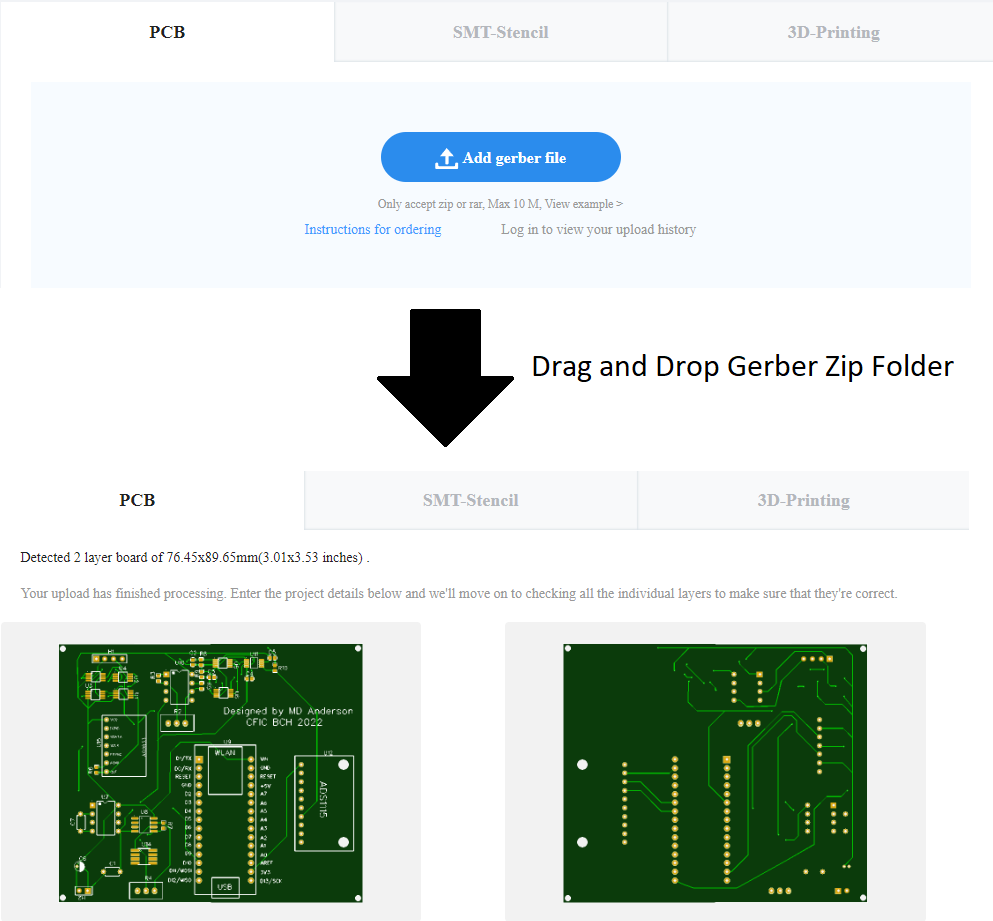
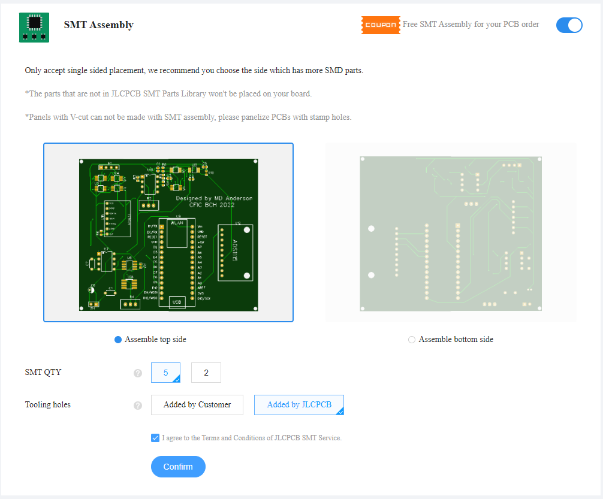
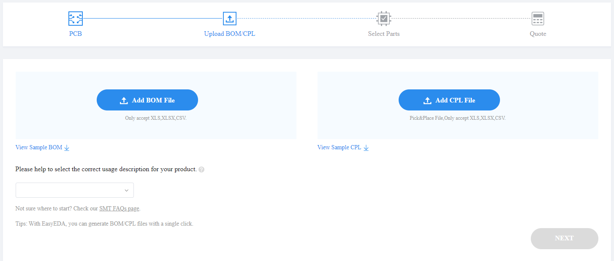

[10uF SMD Capacitor]:Parts.yaml#capacitor603
[35pF SMD Capacitor]:Parts.yaml#capacitor603
[0.1uF SMD Capacitor]:Parts.yaml#capacitor603
[2k SMD Resistor]:Parts.yaml#resistor603
[50 SMD Resistor]:Parts.yaml#resistor603
[300 SMD Resistor]:Parts.yaml#resistor603
[1k SMD Resistor]:Parts.yaml#resistor603
[SPDT Switch]:Parts.yaml#MAX4644EUAT
[ICL7660 Chargepump]:Parts.yaml#ICL7660SCPAZ
[Arduino Nano]:Parts.yaml#Arduino
[OP295 OP Amp]:Parts.yaml#OP295GPZ
[INA592 Diff Amp]:Parts.yaml#INA592IDGKR
[ADS1115 Breakout]:Parts.yaml#ADS1115
[REF200 Current Source]:Parts.yaml#REF200AU2K5
[ad9833 Function Generator]:Parts.yaml#AD9833
[LM358 OP Amp]:Parts.yaml#LM358
[Curved Soldering Iron Tip]:Parts.yaml#Curved_Solder_Iron_Tip
[Straight Soldering Iron Tip]:Parts.yaml#Straight_Solder_Iron_Tip
[16x1 Female Pin Header]:Parts.yaml#Female_pin_header
[7x1 Female Pin Header]:Parts.yaml#Female_pin_header
[10x1 Female Pin Header]:Parts.yaml#Female_pin_header
[0.5mm Solder Wire]:Parts.yaml#0.5mm_solder
[0.3mm Solder Wire]:Parts.yaml#0.3mm_solder
[Wire Snips]:Parts.yaml#wire_snips
[Solder Sucker]:Parts.yaml#solder_sucker
[Soldering Iron]:Parts.yaml#Soldering_Iron
[Grabber Tool]:Parts.yaml#Grabber
[Soldering]{Qty:1, cat: skills}

# Assembly Instructions

{{BOM}}

## Step 1: Order PCB

1. Download the [Gerber File](files/Gerber_PCB_Flexi-TEER.zip), [BOM](files/BOM_PCB_Flexi-TEER_2022-05-02.csv) and [Pick and Place File](files/PickAndPlace_PCB_Flexi-TEER_2022-05-02.csv) for the PCB.
* Sign into account or create an account if new.
* Go to [JLCPCB Website](https://cart.jlcpcb.com/quote?edaOrderUrl=https%3A%2F%2Feasyeda.com%2Forder&electropolishingOnlyNo=no&achieveDate=72 ) website and upload Gerber zip folder. 
* While on the page, drag and drop Gerber zip folder into area that asks for it. In the example image, I also used the SMT assembly service by selecting it.
*  Upload **BOM** and **Pick and Place** .csv files. Select electronics and hobbies/developmental board for the description. 
* Select parts that you desire to be soldered onto the board for you via the SMT assembly service.

>i **Note**
>i SMT Assembly service is an affordable service where certain components are soldered to the board for you. Not every current component is compatible with this service. I recommend using this as its time consuming to solder these very tiny components. 

## Step 2: Order Components

1. Go to [mouser project](https://www.mouser.com/ProjectManager/ProjectDetail.aspx?AccessID=c21611a5ee) and order integrated circuit (IC) components. 
* Order remaining generic parts such as 603 footprint resistors and capacitors. 

>i **Note**
>i If you used the SMT assembly service, you do not need to order those parts again. 

>i **Note**
>i Not all parts make sense to order individually. I recommend ordering the 603 footprint resistors and capacitors as part of variety book set. 

## Step 3: Solder Surface Mount Components (SMD)
Solder components onto circuit board in the order below with a [Soldering Iron]{Qty:1, cat: tool}. A strategy that has worked well with small chips is to use a soldering iron with very fine 0.3mm solder. First place some solder onto each pad for the component, then place component with [Grabber Tool]{Qty:1, cat: tool} and press into place with tweezers and gently touch each lead from the component with the soldering iron until the solder melts around it. 

>i **Note**
>i a [Curved Soldering Iron Tip]{Qty: 1, cat: tool} will help solder SMD components to board.

>i **Note**
>i If you used the SMT service, some of these parts may already be installed. 

1. [10uF SMD Capacitor]{Qty: 2}
* [35pF SMD Capacitor]{Qty: 2}
* [0.1uF SMD Capacitor]{Qty: 2}
* [2k SMD Resistor]{Qty: 2}
* [50 SMD Resistor]{Qty: 1}
* [300 SMD Resistor]{Qty: 3}
* [1k SMD Resistor]{Qty: 1}
* [SPDT Switch]{Qty: 6}
* [INA592 Diff Amp]{Qty: 1}
* [REF200 Current Source]{Qty: 1}
* [LM358 OP Amp]{Qty: 1}

## Step 4: Solder Through Hole Components

>i **Note**
>i a [Straight Soldering Iron Tip]{Qty: 1, Cat: tool} will help solder through hole components to board.

1. 2x [16x1 Female Pin Header]{Qty: 2}, one for each side of Arduino Nano IOT
2. 1x [7x1 Female Pin Header]{Qty: 1} in ad9833 socket
3. 1x [10x1 Female Pin Header]{Qty: 1} in ADS1115 socket

## Step 4: Solder Male Pin Headers
If ordered any breakout boards (ADS1115, AD9833, Arduino, etc.), solder male pin headers to each board.

## Step 5: Attach Breakout Boards
Attach each breakout board and Arduino into respective sockets.

## Step 6: Flash Arduino Sketch
Currently no sketch is available. 

